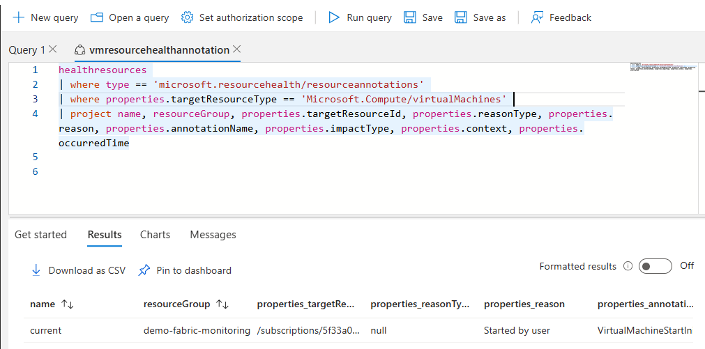
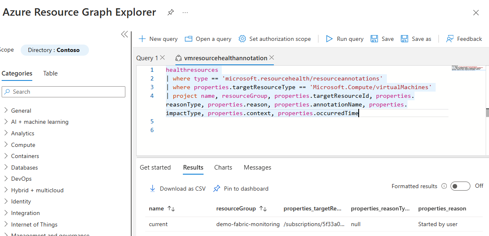
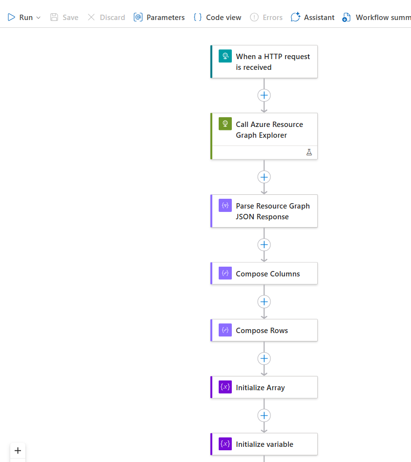
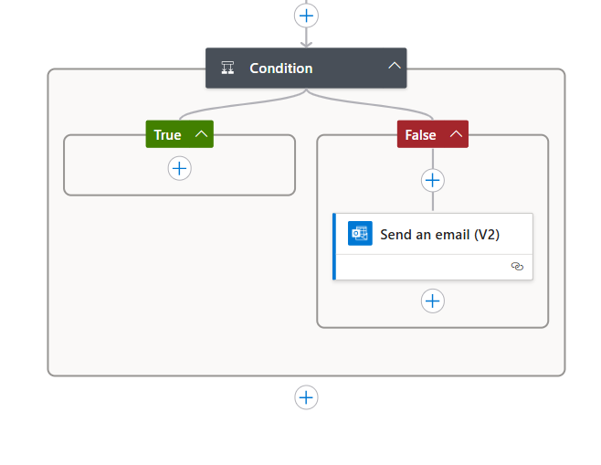

# Azure Sample - Combine VM Availability Alert and Resource Graph based VM Health Status with Logic App Action

## Summary

Use LogicApp as an Alert action and decide whether to send a notification (e.g. e-mail) or not based on additional information (Azure Resource Health information in this case) when VM Availability metrics threshold is reached.

## Automated Deployment with GitHub Actions

This repository includes a GitHub Action workflow that automatically deploys the Logic App infrastructure using Terraform to your Azure subscription in tenant `539d8bb1-bbd5-4f9d-836d-223c3e6d1e43`.

### Prerequisites

1. **Azure App Registration with Federated Identity**: Create an App Registration with federated identity credentials for GitHub Actions:
   ```bash
   # Create app registration
   az ad app create --display-name "logic-app-deployment-oidc" --sign-in-audience AzureADMyOrg
   
   # Create service principal and assign roles
   APP_ID=$(az ad app list --display-name "logic-app-deployment-oidc" --query "[0].appId" -o tsv)
   az ad sp create --id $APP_ID
   
   # Configure federated identity for your repository
   az ad app federated-credential create --id $APP_ID --parameters '{
     "name": "github-actions-main",
     "issuer": "https://token.actions.githubusercontent.com",
     "subject": "repo:YOUR_GITHUB_USERNAME/azuresamples-vm-availability-logicapp:ref:refs/heads/main",
     "audiences": ["api://AzureADTokenExchange"]
   }'
   ```

2. **GitHub Secrets**: Configure the following secrets in your GitHub repository:
   - `AZURE_CLIENT_ID`: App Registration application ID
   - `AZURE_SUBSCRIPTION_ID`: Your Azure subscription ID
   - `AZURE_TENANT_ID`: Azure tenant ID (539d8bb1-bbd5-4f9d-836d-223c3e6d1e43)
   - `AZURE_TARGET_SUBSCRIPTION_ID`: Subscription ID to monitor for VM availability (can be the same as AZURE_SUBSCRIPTION_ID)
   - `NOTIFICATION_EMAIL`: Email address for alert notifications
   - `STATE_STORAGE_ACCOUNT`: Azure Storage account name for Terraform state
   - `STATE_CONTAINER`: Azure Storage container name for Terraform state
   - `STATE_RESOURCE_GROUP`: Azure Resource Group containing the storage account
   - `STORAGE-ACCESS-KEY`: Storage account access key for Terraform state

   **Note**: With federated identity, you no longer need `AZURE_CLIENT_SECRET`, enhancing security.

### Deployment Options

#### Automatic Deployment
- Push changes to the `main` branch to trigger automatic deployment
- The workflow will run `terraform plan` on pull requests and `terraform apply` on merge to main

#### Manual Deployment
Use the manual workflow dispatch in GitHub Actions:
1. Go to Actions tab in your GitHub repository
2. Select "Deploy Logic App Infrastructure"
3. Click "Run workflow"
4. Choose action: `plan`, `apply`, or `destroy`

### Infrastructure Components

The Terraform configuration deploys:
- **Resource Group**: Contains all Logic App resources
- **User-Assigned Managed Identity**: For secure access to Azure Resource Graph
- **Role Assignment**: Reader permissions for the managed identity on the target subscription
- **App Service Plan**: Dedicated hosting environment for Logic App Standard (WS1 SKU)
- **Storage Account**: Required storage for Logic App Standard runtime and state
- **Office 365 API Connection**: For sending email notifications
- **Logic App Standard**: The main workflow application with enhanced features and performance

### Configuration

Copy `terraform/terraform.tfvars.example` to `terraform/terraform.tfvars` and customize the values:

```hcl
subscription_id        = "your-subscription-id"
target_subscription_id = "subscription-to-monitor"
notification_email     = "your-email@domain.com"
resource_group_name    = "rg-vm-availability-logicapp"
location              = "East US"
```

### Workflow Outputs

After successful deployment, the workflow outputs:
- Resource Group name
- Logic App name and ID
- Managed Identity Principal ID
- HTTP trigger callback URL (sensitive)

## Steps




1) Azure VM Availability (preview) Metric used to define Azure Alert


1.1) Alert Definition - Conditions


1.2) Azure Alerts showing VM Availability alert triggered


2) Azure Resource Graph query used to retrieve Azure VM resource health information



3) Logic App with the workflow to:
   
- Receive alert
- Query Azure Resource Graph API to retrieve Resource Health information
- Decide based on the status whether to send e-mail notification or ignore the alert

> [!NOTE]
> Logic App Workflow code is available in the [logicapp.json](logicapp.json)



1) Logic App with the workflow - Condition 

IF "VirtualMachineDeallocationInitiated" (means a user has requested VM to be stopped) then ignore the Alert




## References

- https://learn.microsoft.com/en-us/azure/azure-monitor/alerts/alerts-logic-apps?tabs=send-email